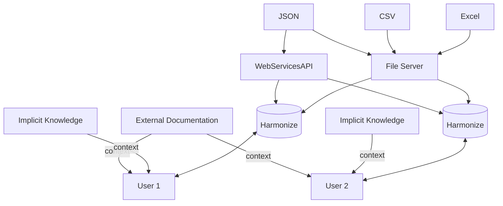
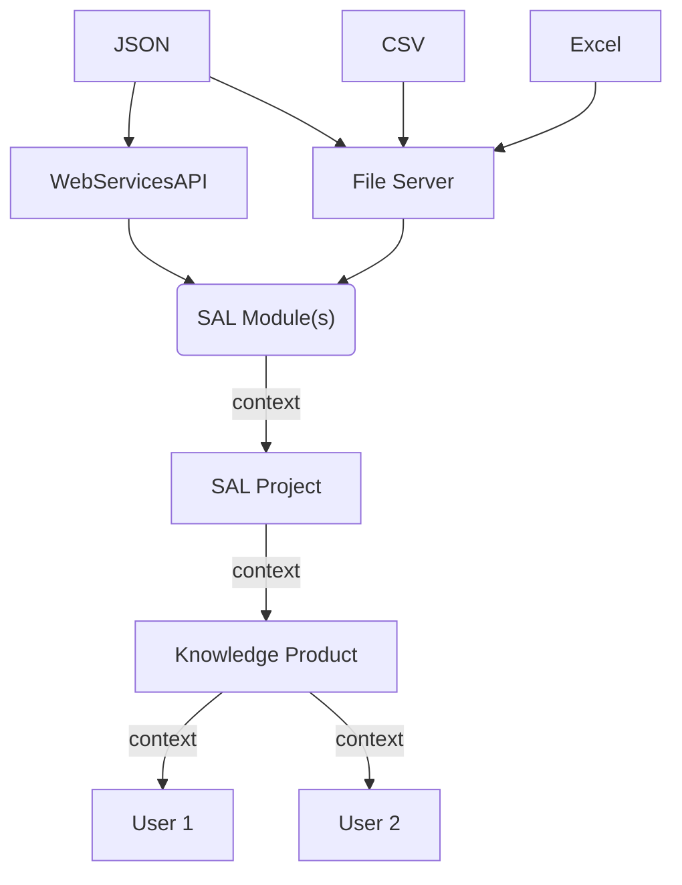

# Semantic Accessibility Layer (SAL) System

The following sections outlines the SAL vision.


## Problem

Open data is published in a variety of distribution formats and methods, some of which conform to established standards. These publications mostly use familiar, semi-structured formats such as CSV or JSON, which offer superficial simplicity for downstream users and applications. Nevertheless, extensible data formats, standards-based or not, lack the expressive syntax needed to relate and reuse data with contextual, interoperable semantics across diverse technology environments and domains. Data standards do contribute to interoperability and reuse, but their adoption is often limited by competing priorities, high implementation costs, legacy system constraints, and lack of incentives.  The current open data ecosystem, such that it is, is stymied by its inability to foster a cycle of secondary consumption as it perpetuates low context 'carbon copies' of primary knowledge which undermines its use as trusted data in derivative outputs—preventing a closed loop necessary in any ecosystem. 

Additionally, open data distribution methods are selected by the publisher based on intended access patterns and often shaped by resource constraints. Application Programming Interfaces (APIs) are best aligned for responsive controlled access of changing "live" datasets serving small subsets of a few key entities at a time.  Conversely, static files are  are typically used for infrequently updated data served from a file server or other file distribution method. Serving static files invariably offers the simplest option for the open data publisher. It requires minimal infrastructure and operational maintenance, as it avoids the need for databases, APIs, and perhaps other infrastructure.  The tradeoff is that users often have to navigate fragmented access patterns just to acquire open data, creating unnecessary overhead before analysis can begin. 

The compounding reality for the open data user is that questions cannot always be answered from a single dataset.  Harmonizing open datasets published in various distribution formats, access, and documentation methods, places a heavy burden on the user to derive the insight needed to answer questions.   Once this work is complete, there isn’t an easy way to encode and publish the essential context gathered from the process in a way that can be universally understood, related, attributed,  and reused by others. As such, continuity cannot be established by open data users as a whole to answer hard questions which dictate trusted, iterative outputs.  



## Solution

The Semantic Accessibility Layer system (SAL) is composed of a core module specification (SAL Module) and components that build on the specification. The SAL Module specification uses an ontology (SAL Ontology, `sal:`) to describe a common command-line usage interface for describing data models and exposed containerized application logic that operates on them using JSON-LD (RDF). It promotes interoperability at the point of acquisition by semantically unifying data, metadata, and application logic into a portable, referenceable module—laying the groundwork for the consistent reuse of source data across diverse systems. The SAL command-line interface tool (SAL CLI) enables users to create projects using familiar software development lifecycle stages, generating knowledge products using SAL CLI through orchestration of SAL Modules.  SAL enables users to co-create uniformly described portable knowledge products based on existing published sources that can serve as building blocks towards community-built knowledge networks. 





### SAL Module Command Line Interface Usage

The SAL Module specification consists of a JSON-LD based vocabulary [here](sal.jsonld) which describes a command line interface (CLI) usage specification for containers.  When implemented by a containerized application, a SAL Module compliant container implementation provides self-describing data models and exposed application logic to produce building blocks of highly contextualized data. This data can be retrieved using the SAL Module container as a standalone command or orchestrated through SAL CLI to produce knowledge products that can be published, shared, and (re)used. 


####  SAL Module Behaviors

##### Provide ontology 

SAL Module expects a compliant container to provide its ontology (i.e. vocabulary) using the following command line interface usage:


`docker run IMAGE sal (ontology|vocabulary|vocab)`

SAL Modules MUST declare and implement at least one `sal:NodeProcessor` subclass in their ontology. Each `sal:NodeProcessor` subclass MAY add the SAL annotation properties `sal:input`, `sal:output`, `sal:self` to their subclass declaration. The `sal:input` annotation property describes the SHACL `sh:NodeShape` that a `sal:NodeProcessor` instance(s) expects to receive. Conversely, `sal:output` describes the SHACL `sh:NodeShape` that a `sal:NodeProcessor` instance expects to produce. Finally,  `sal:self` describes the SHACL `sh:NodeShape` that an instance of the `sal:NodeProcessor` subclass instance should conform to.   

where...

IMAGE is the name of the docker image that adheres to the SAL Module command line interface usage behavior. 


**Example 1**
The following example displays the ontology for docker image `MYIMAGE` where a single `sh:NodeProcessor` subclass is defined ( i.e. `EducationalHistoryFinder`). that accepts JSON-LD node objects conforming to the SHACL shape `PersonShape` and produces JSON-LD node objects conforming to SHACL shape `PersonAndEducationShape`. Instances of  `EducationalHistoryFinder` execute the logic to augment a `schema:Person` node object with their educational background when given their first name, last name, and date of birth.   

```
$ docker run MYIMAGE sal ontology
{
    "@context": { 
        "schema":"https://schema.org/",
        "sh": "http://www.w3.org/ns/shacl#",
        "xsd": "http://www.w3.org/2001/XMLSchema#",
        "sal":"https://w3id.org/datacequia/sal#",
        "owl": "http://www.w3.org/2002/07/owl#",
        "rdfs": "http://www.w3.org/2000/01/rdf-schema#"
    },
    "@graph": [
        {
            "@id": "PersonShape",
            "@type": "sh:NodeShape",
            "sh:targetClass": {"@id":"schema:Person"},
            "sh:property": [
                {
                    "sh:path": {"@id":"schema:givenName"},
                    "sh:datatype": {"@id":"xsd:string"},
                    "sh:minCount": 1,
                    "sh:maxCount": 1
                },
                {
                    "sh:path": {"@id":"schema:familyName"},
                    "sh:datatype": {"@id": "xsd:string"},
                    "sh:minCount": 1,
                    "sh:maxCount": 1
                },
                {
                    "sh:path": {"@id":"schema:birthDate"},
                    "sh:datatype": {"@id":"xsd:date"},
                    "sh:minCount": 1,
                    "sh:maxCount": 1
                }
  ]

        },      
        {
            "@id": "PersonAndEducationShape",
            "@type": "sh:NodeShape",
            "sh:targetClass": {"@id":"schema:Person"},
            "sh:property" : [
                {
                    "sh:path": {"@id":"schema:givenName"},
                    "sh:datatype": "xsd:string",
                    "sh:minCount": 1,
                    "sh:maxCount": 1
                },
                {
                    "sh:path": {"@id","schema:familyName"},
                    "sh:datatype": "xsd:string",
                    "sh:minCount": 1,
                    "sh:maxCount": 1

                },
                {
                    "sh:path": {"@id": "schema:birthDate"},
                    "sh:datatype": "xsd:date",
                    "sh:minCount": 1,
                    "sh:maxCount": 1
                   
                },
                {
                    "sh:path": {"@id":"schema:alumniOf"},
                    "sh:nodeKind": "sh:IRIOrBlankNode" 
                }
            ]

        },
        {
            "@id": "EducationalHistoryFinder",
            "@type": "owl:Class",
            "rdfs:subClassOf": {"@id": "sal:NodeProcessor"},
            "sal:input": {"@id":"PersonShape"},
            "sal:output": {"@id":"PersonShape"}
        }
        ]
}

$ 
```

##### Run sal:NodeProcessor


A SAL Module compliant container allows a user to run a defined instance of a `sal:NodeProcessor` subclass (node-processing instance) declared in it's ontology. These instances are passed to the container's `run` command using the `SAL_NP_INSTANCE` environment variable. The `sal:NodeProcessor` subclass instance serves to provide context to the sal:NodeProcessor runtime logic. 

> Note: one simple example for adding `sal:NodeProcessor` properties may be to describe an external host's connection properties that are needed by the sal:NodeProcessor run(time) logic to connect to a data source.


`docker run -e SAL_NP_INSTANCE="<sal:NodeProcessor node object instance>" MYIMAGE sal run`

Building on Example 1, The following example shows how an instance of `sal:NodeProcessor` subclass `EducationalHistoryFinder` is invoked from the command line. 

Note: The response printed to 

```
$ SAL_NP_INSTANCE='{"@id":"http://example.org/#pistolpete","@type":"EducationalHistoryFinder"}' 
$ docker run MYIMAGE sal run -e SAL_NP_INSTANCE="${SAL_NP_INSTANCE}" 
{"@id":"http://example.org/#pistolpete","@type":"schema:Person","schema:givenName":"Frank","schema:familyName":"Eaton","schema:birthDate":{"@id":"xsd:date", "@value":"1888-09-17"},"schema:alumniOf":{"@id":"http://nmsu.edu/","@type":"schema:EducationalOrganization","schema:name": "New Mexico State University"}}
$ 
```


Notes from OpenGovLab on Why data Commons

So hard to process open data
Waste in fragmentation of open data processing. Many are doing it but then don’t share in a way that can be leveraged.

Concept of Data commons provides access to  high quality processed data in ways that is AI ready in a way to have new infrastructure and provide conversational way to open data. 

### Class Diagram
```mermaid
classDiagram
    class DataProduct["dprod:DataProduct"]
    class SofwareApplication["schema:SoftwareApplication"]
    class ContainerizedApplication["sal:ContainerizedApplication"]
    class SALDataProduct["sal:SALDataProduct"]
    class Action["schema:Action"]
    class SALAction["sal:SALAction"]
    class CLICommandAction["sal:CLICommandAction"]
    SofwareApplication <-- ContainerizedApplication: rdfs#58;subClassOf
    DataProduct <--  SALDataProduct : rdfs#58;subClassOf
    Action <-- SALAction : rdfs#58;subClassOf
    SALAction <-- CLICommandAction : rdfs#58;subClassOf
    CLICommandAction <-- CLIOntologyCommandAction 
 ```       

